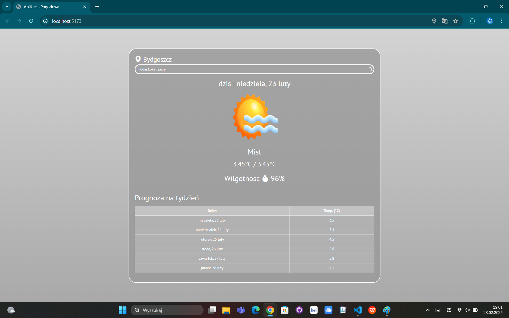

# Aplikacja Pogodowa w React

Aplikacja pogodowa, która wyświetla aktualną pogodę oraz prognozę na najbliższy tydzień. Użytkownik może wyszukać lokalizację lub pozwolić aplikacji na automatyczne wykrycie swojej lokalizacji. Aplikacja została wykonana jako projekt zaliczeniowy na przedmiot **Nowoczesny frontend aplikacji internetowych**.

## Funkcje
- Wyświetlanie aktualnej pogody (temperatura, wilgotność, warunki pogodowe).
- Prognoza pogody na najbliższy tydzień.
- Automatyczne wykrywanie lokalizacji użytkownika.
- Możliwość wyszukiwania lokalizacji ręcznie.
- Dynamiczne tło i ikony pogodowe w zależności od warunków pogodowych.

## Użyte technologie
- **React**: Biblioteka do budowy interfejsu użytkownika.
- **Bootstrap i CSS**: Nadawanie styli komponentów.
- **OpenWeatherMap API**: API do pobierania danych pogodowych. [Strona OpenWeather](https://openweathermap.org/)
- **Geoapify API**: API do zamiany współrzędnych geograficznych na adres (Reverse Geocoding). [Strona Geoapify](https://www.geoapify.com/)

- **Obrazki pogodowe**: Użyto obrazków dla najpopularniejszych warunków pogodowych:      
 (Zdjęcia zostały pobrane z [Freepik - ikony pogody](https://pl.freepik.com/darmowe-wektory/gradienty-ikony-pogody-dla-kolekcji-aplikacji_15292634.htm))
  - Słońce
  - Chmury
  - Deszcz
  - Śnieg
  - Mgła
  

## Zdjęcia przykładowego użycia
1. **Lokalizacja**:

2. **Słoneczny dzień**:

3. **Deszczowy dzień**:

4. **Pochmurny dzień**:

5. **Śniezny dzień**:

6. **Mglisty dzień**:

## Instalacja i uruchomienie
Po przejściu do folderu `weather-app` należy wpisac w konsoli `npm install`. Nastepnie można już uruchomić aplikację za pomocą komendy `npm run dev`.

